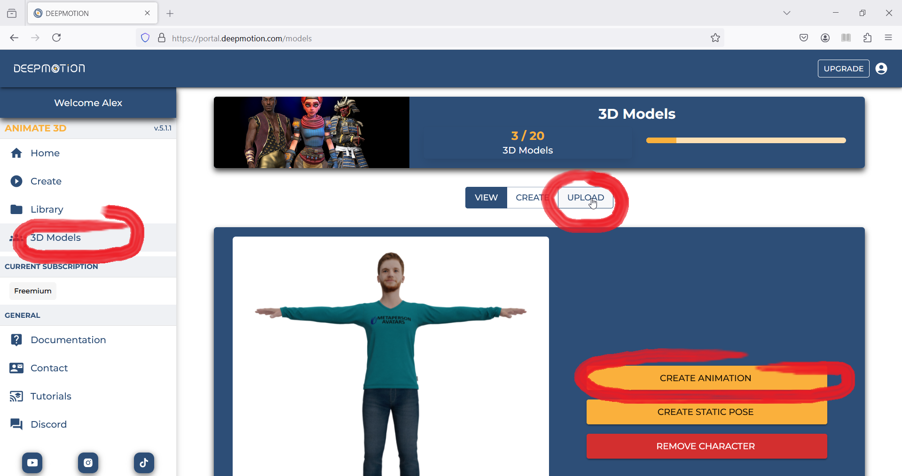
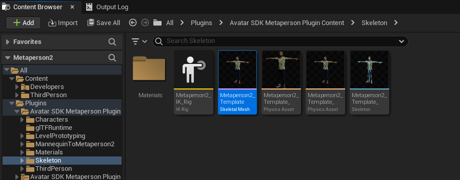
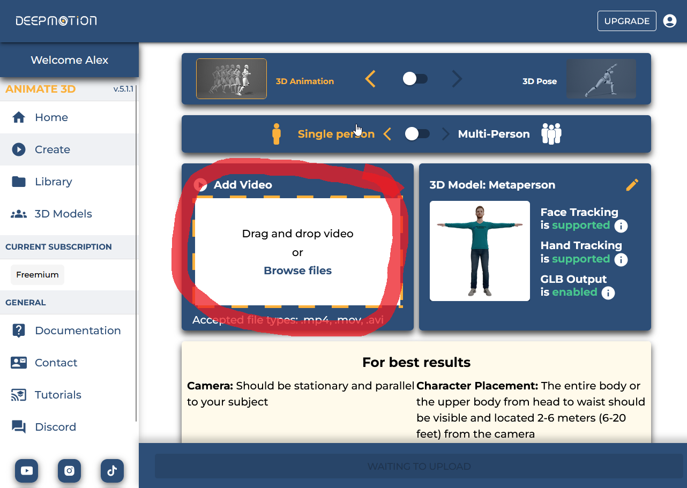
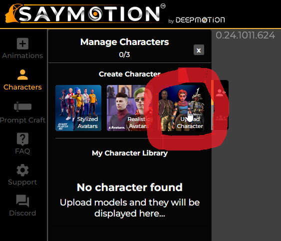
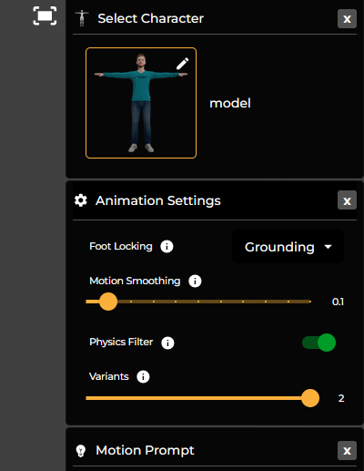
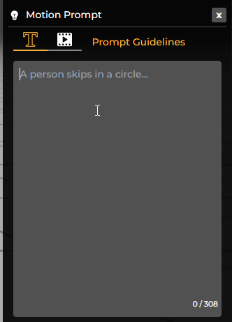
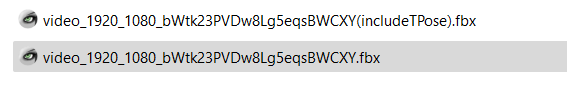
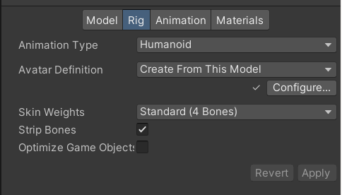

# DeepMotion

[DeepMotion](https://www.deepmotion.com/) offers a comprehensive suite of advanced tools specifically designed for the creation of intricate skeletal animations. These advanced tools can animate MetaPerson avatars with high precision and realism, offering users an unmatched digital animation experience.

<iframe width="560" height="315" allow="fullscreen"
src="https://www.youtube.com/embed/AV6cLtuZra4?si=RMnHzYgjKES1Awe2">
</iframe>

&nbsp;

<iframe width="560" height="315" allow="fullscreen"
src="https://www.youtube.com/embed/ujMxgmFz-pM?si=mJqt8fa_OKHSB5Ha">
</iframe>

&nbsp;

## Animate 3D

[Animate 3D](https://www.deepmotion.com/animate-3d) is an innovative and powerful tool that gives you the ability to transform your regular videos into captivating and immersive 3D animations. These animations are not only visually appealing but also feature realistic and smooth movements that bring your content to life in a way that is engaging and dynamic.

### Uploading 3D avatar

To generate a MetaPerson-compatible animation with the Animate 3D, you will need to provide a sample avatar model in the "3D Models" section. Click the Upload button, select the fbx model and after it is uploaded, click the Create Animation button to continue. 

#### Unity and UE

For Unity you may use the generic fbx model exported from the MetaPerson Creator, for Unreal Engine you will need to export the fbx model from the [MetaPerson UE Plugin](https://github.com/avatarsdk/metaperson-ue-sample).

### Animation parameters

Provide your video file in the corresponding section:

and adjust the suggested animation settings.

Create the animation and download the FBX file.

## SayMotion

SayMotion uses Generative AI and DeepMotion's motion data to turn text into 3D animations. It removes the need for special equipment, expertise, or stock animations, making 3D animation available to everyone. 

### Uploading 3D avatar

You will need to upload the MetaPerson avatar in the same way we did for Animate 3D. Click on the corresponding button and provide the fbx file. See the [platform specific information](#unity-and-ue).

### Animation parameters

Choose the uploaded avatar and adjust the suggested animation settings.

To proceed, provide your animation prompt. For more detailed guidance, you can refer to the [official DeepMotion guide](https://www.deepmotion.com/article/saymotion-text-prompt-guide), which offers comprehensive instructions on generating effective prompts for your animations. 

Generate the animation and download the FBX file.

## Importing animations

Import the fbx file that does not include T-Pose:

For Unreal Engine use the following import settings:

When importing to your Unity project, it is crucial to set the animation type to "Humanoid" in the rig parameters:

Then, set the following parameters in the "Animation" tab:

Create the Animation Controller and drag the imported animation to the graph. Set the Foot IK option to "true".

Set the Animation Controller to the corresponding property of the Animator, attached to the avatar's model on the scene:

Now everything is ready and your MetaPerson avatars are fully animated and eagerly awaiting for you to come and see them in action!

## Additional information

We strongly encourage you to take the time to watch the comprehensive videos about using the DeepMotion technology in conjunction with the MetaPerson on both [Unity](https://youtu.be/AV6cLtuZra4?feature=shared) and [Unreal Engine](https://youtu.be/ujMxgmFz-pM?feature=shared). These tutorials are more detailed and provide a wealth of information that can be very helpful. If you still have any questions or need further assistance, please do not hesitate to reach out to us at support@avatarsdk.com.