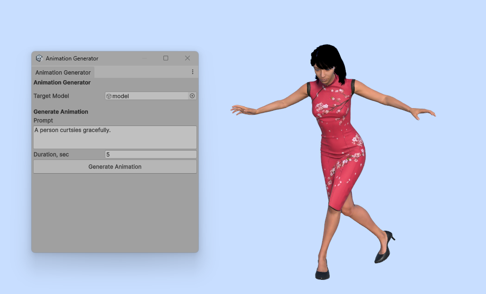
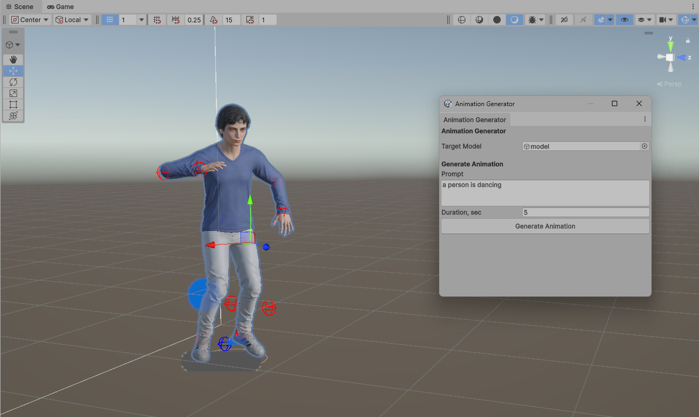
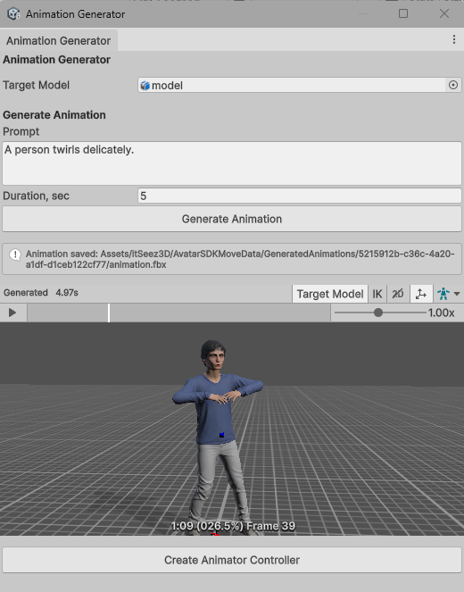
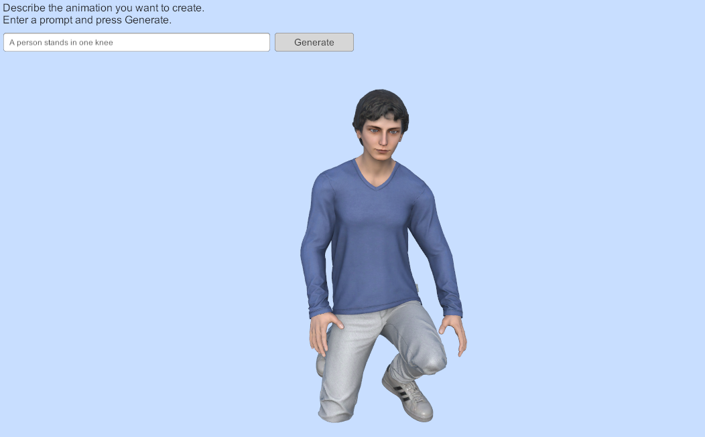
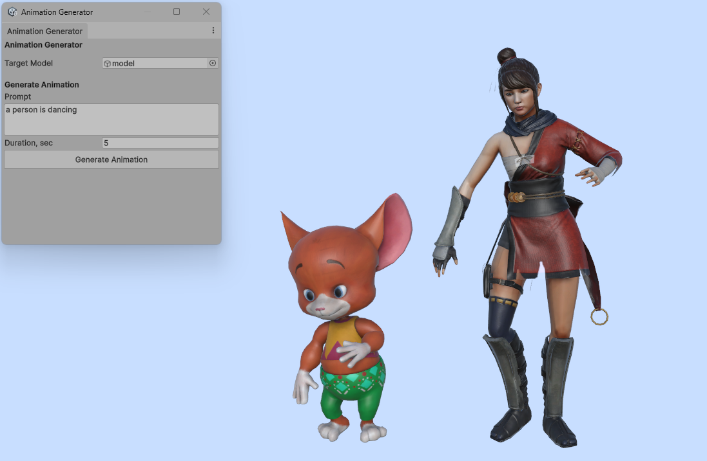

# Move Unity plugin

The Avatar SDK Move Unity plugin generates animations from a text description inside Unity. In the
Editor you build a library of clips as project assets; at runtime your application can generate
animations on demand, so the people using your app can describe the movement they want and watch it
play.

For an overview of the technology and the web editor, see [Avatar SDK Move](/move). Product details, licensing and the latest release notes live on the [Move Unity plugin page](https://avatarsdk.com/move-unity-plugin/) at avatarsdk.com.

:::info Beta
The plugin is currently in beta — generation is unlimited for testing and evaluation. See the
[product page](https://avatarsdk.com/move-unity-plugin/) for current status, or write to
[support@avatarsdk.com](mailto:support@avatarsdk.com) about commercial use and licensing.
:::

## Installation

1. [Download the plugin](https://releases.avatarsdk.com/move/unity/avatar_sdk_move_0.0.1.unitypackage)
   and import the `.unitypackage` into your project.
2. The Account window opens automatically. Enter your email, then the one-time code you receive.
3. Open one of the included sample scenes — one shows the Editor workflow, the other end-to-end
   runtime generation driven from a UI.

## Your first animation in the Editor

1. Open **Avatar SDK Move → Animation Generator**.
2. Assign your humanoid model.
3. Type what you want it to do.
4. Press **Generate Animation**.



The clip is downloaded, imported as a Humanoid FBX, and starts playing in the preview — on your
model, not on a generic mannequin.



If you want it wired up, one button builds an Animator Controller from the clip and assigns it to
your character.



## Generating animations at runtime

Add the `AnimationGenerator` prefab to the scene and call `Generate`:

```csharp
// targetModel — a GameObject with an Animator whose Avatar is Humanoid
// prompt      — plain-text description of the movement
// duration    — requested clip length in seconds
AnimationClip clip = await animationGenerator.Generate(targetModel, prompt, duration);
```

The call is asynchronous and completes when the clip is ready to play. Nothing is written to disk:
at runtime the animation is delivered as GLB, parsed in memory and applied to the `Animator`
directly, which is why the same code path also works in a WebGL build where file system access is
unavailable.

Generation takes several seconds, so keep the UI responsive and show progress while awaiting the
call — the included runtime sample demonstrates one way to do it.



## Retargeting

Bones are resolved through Unity's `HumanBodyBones` mapping, so the plugin does not depend on your
skeleton's naming convention — the only requirement is that the model's Avatar is configured as
Humanoid and valid.

Rotations are applied as a delta from each bone's rest pose rather than copied absolutely. Skeletons
whose rest orientation differs from the source therefore keep their intended pose instead of
snapping to the source rig. Root motion is scaled by the ratio of hip heights between the source and
your character, so translation distance stays proportional to the character's size.

If a generated clip looks wrong on your model, check the Avatar configuration first: an unmapped or
mis-mapped bone in the Humanoid rig is the usual cause.



## Requirements and platforms

- **Unity version:** Unity 6000.0 or newer.
- **Supported platforms:** Windows, macOS, Linux, WebGL, Android and iOS.

## Notes and limitations

**Model requirements.** Any model with a valid Humanoid Avatar works; MetaPerson sample characters
ship with the plugin so you have something to test against immediately. Generic and Legacy rigs are
not supported.

**Clip format differs by context.** In the Editor a clip arrives as FBX and is imported as a
standard Unity Humanoid `AnimationClip` — usable in Animator Controllers, Timeline and blend trees
like any other asset. At runtime it arrives as GLB and exists only in memory for that session; store
the prompt, not the clip, if you need to reproduce it later.

**Shipping runtime generation.** Generation happens in the cloud, so a build that generates
animations at runtime needs network access and your account credentials configured in the project.
Plan for the failure path — no connection, or a request that takes longer than your UI expects.

**Prompt length and duration.** Longer requested durations take longer to generate. Start with short
clips (a few seconds) while iterating on prompt wording.
