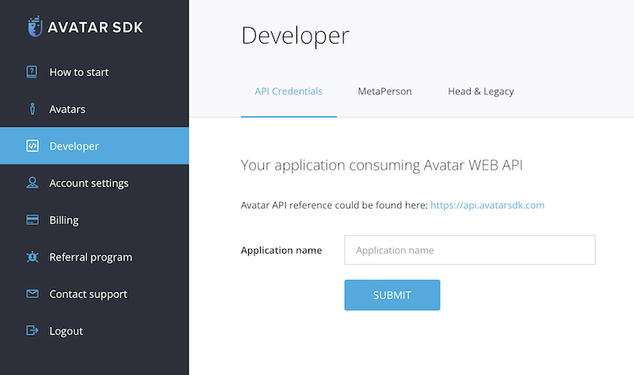
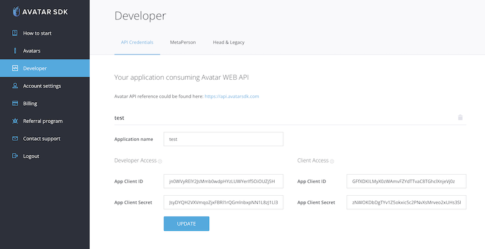

# Getting Started

> Get started with MetaPerson Creator: create an account, integrate the avatar builder into your app, and let users generate 3D avatars from a single selfie.

# Getting Started

## Account

To start using **MetaPerson Creator**, simply create an account on [our website](https://accounts.avatarsdk.com).
By doing so, you'll gain access to the [free trial](https://avatarsdk.com/pricing-cloud/) of the Pro plan, which offers all our advanced features and the ability to create and customize MetaPerson avatars.

## Developer Credentials

Before you can integrate **MetaPerson Creator** into your website or application, you need to generate developer credentials in your profile. This is a simple process — just visit the [developer credentials page](https://accounts.avatarsdk.com/developer/#web-api).

On the developer page, you'll need to create a new application to obtain your **App Client ID** and **App Client Secret** values. To do this, enter a name in the **Application name** field and click the **SUBMIT** button.

Once the application is created, your **App Client ID** and **App Client Secret** values will be displayed.

With your developer credentials, you can integrate **MetaPerson Creator** into your website or application and start creating custom avatars for your users.

## Support

Have a question or need help? Contact us at [support@avatarsdk.com](mailto:support@avatarsdk.com) — our team is always available to assist you.
