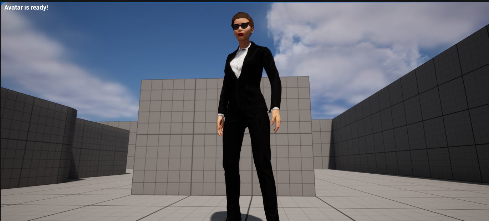

# GitHub Sample

The sample is based on Epic's Third Person [template](https://docs.unrealengine.com/5.0/en-US/third-person-template-in-unreal-engine/) and demonstrates how to integrate MetaPerson Creator into your project. Playing the level opens MetaPerson Creator in the HUD. After that, all of the avatar creation/customization features are available to the user. 

When the user finishes the avatar creation process, he can press the Export button. **If you’ve incorrectly added your credentials, or if your account doesn’t have a Pro plan or higher, the Export button may be inactive.**  

When the export process is complete, the MetaPerson Creator will close and the download will begin. 

The archive with the avatar will be saved to the local disk and unzipped. After that skeletal mesh of the avatar will be loaded from the glb file. Avatar will be placed in the level instead of the third-person character.

### Technical details

For detailed information about the MetaPerson Creator integration, see the [relevant part](metaperson_creator_integration) of the documentation.

### Animations

We use UE5 [IK Rig Retargeting](https://docs.unrealengine.com/5.0/en-US/ik-rig-animation-retargeting-in-unreal-engine/) to retarget animations (and animation blueprints) from Mannequin to MetaPerson 2 skeleton. 
The animation retargeting process is described in the [corresponding chapter](animation_retargeting).

## FAQ.

### Which platforms are supported by the sample?

Currently, the sample is Windows-only (as a development and target platform). We hope to expand the number of supported platforms in future releases.

### Which version of UE is supported?

Versions 5.1, 5.2, 5.3 of the Unreal Engine are supported.

### The "export " button is not accessible in the MetaPerson Creator. What should I do?

Please, double-check that you entered the correct Client ID and Client Secret. See the [Running the sample](#running-the-sample) for more details.

## Support

You can address any questions about the UE integration or the avatar generation, general feedback, ideas, or feature requests to  [support@avatarsdk.com](mailto:support@avatarsdk.com). 
For commercial inquiries or licensing questions please use [business_support@itseez3d.com](mailto:business_support@itseez3d.com).