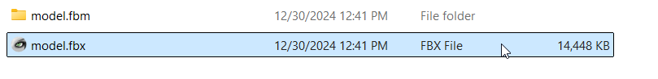
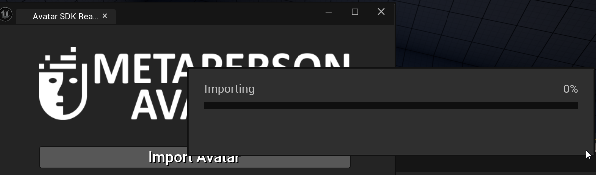

# Import in UE Editor

The main goal of the UE MetaPerson plugin is to help developers create, customize and import MetaPerson avatars at runtime. At the same time, with a couple of clicks you can import to the Editor `.fbx` avatars you created with web version of the [MetaPerson Creator](https://metaperson.avatarsdk.com/). To import `.fbx`:

1. Export the archive with avatar you downloaded from the MetaPerson Creator.
2. Open the Plugin window:

3. Click on the corresponding button:

4. Provide path to the `.fbx` file

After that the import process begins

5. To see your avatar in action, load and run the `/AvatarSDKMetaperson2/ThirdPerson/Maps/LoadAvatarMap`. You will see the imported avatar on the scene.

You can still seamleslly change the avatar skeletal mesh with new one imported from .glb file at runtime.

All of the assets imported from `.fbx` are available at `/All/Game/MetapersonAvatars` folder.
