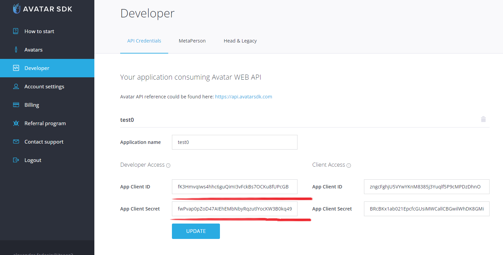

# Overview

This project demonstrates how to create and use MetaPerson avatars with Epic animations. 

## Running the sample

You will need an account on the Avatar SDK website to export MetaPerson avatars. If you don't have an account yet, you can create it [here](https://accounts.avatarsdk.com/). After that, you can take a [free trial](https://avatarsdk.com/pricing-cloud/) of the Pro plan. It gives you access to all of the needed features.

To run the demo scene you will need developer credentials that can be found on your [developer page](https://accounts.avatarsdk.com/developer/). Developer credentials are a pair of values (Client ID and Client Secret).

See the [additional documentation](https://docs.metaperson.avatarsdk.com/getting_started.html#developer-credentials) on the developer credentials. 

Go to the Edit->Project Settings->Plugins->Avatar SDK MetaPerson 2 section in UE Editor and set these parameters in corresponding fields:

