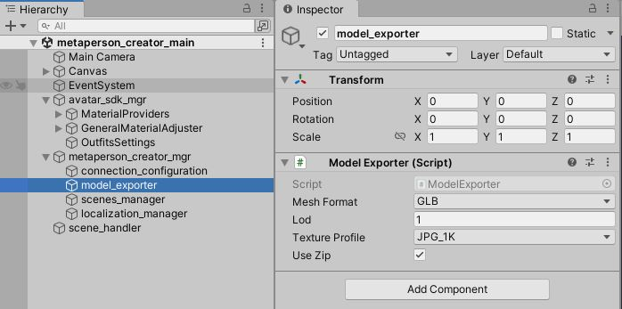

# MetaPerson Creator Unity Project

The [MetaPerson Creator Desktop](https://metaperson.avatarsdk.com) version was developed in Unity.
We offer a source project featuring a customized [MetaPerson Creator Desktop](https://metaperson.avatarsdk.com), retaining all fundamental functionalities. So you can customize it to your needs and integrate it into your project.

This plugin is currently available on the [Enterprise plan](https://avatarsdk.com/pricing-cloud/). To access the project's source code, contact us at support@avatarsdk.com.

<iframe width="560" height="315" allow="fullscreen"
src="https://www.youtube.com/embed/A-2YfJ66mWE?si=EMn9qBItt14-U_yl">
</iframe>

## Getting Started

1\. Extract an archive with the MetaPerson Creator project and open it in Unity.

2\. You will be prompted to provide [credentials](../../getting_started#developer-credentials). Copy **Client ID** and **Client Secret** from your account and press the **Save credentials** button.

3\. Open and run the `Assets/itseez3d/metaperson_creator/scenes/metaperson_creator_main.unity` scene.

## Supported Platforms and Limitations

The primary platform for MetaPerson Creator is **WebGL**. However, it can be run for other platforms with some limitations:
 * The project works in the **Built-In** rendering pipeline.
 * The **file selection** feature works only within the **Unity Editor** and in **WebGL** builds.
 * The **screenshot-sharing** feature functions only within the **Unity Editor** and in **WebGL** builds.
 * **UI** elements are optimized for **desktop** platforms. While they may function on other platforms, some adjustments may be required for optimal user experience.
 * If you encounter low **FPS** on mobile platforms, consider adjusting **Post Processing** and **Quality** settings.

## Export Parameters

The model viewer scene `Assets/itseez3d/metaperson_creator/scenes/metaperson_creator_viewer.unity` allows you to customize a created avatar in various ways and export an optimized lightweight model with applied customizations for further use.

To export an avatar:
- In the viewer scene, locate and click the export button (at the top-right corner of the interface).
- By default, the model is exported with the following settings:
  - LOD1
  - GLB format
  - 1K JPG textures
  - Packed into a ZIP archive

If you need to change any of these parameters, follow these steps:
- Open the `Assets/itseez3d/metaperson_creator/scenes/metaperson_creator_main.unity` scene.
- Find the **model_exporter** object under **metaperson_creator_mgr**.
- Make the necessary changes to the Inspector tab for this object.

