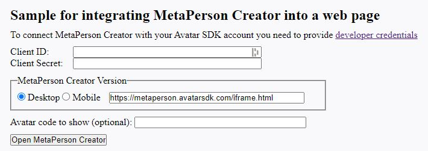

# Web integration

MetaPerson Creator can be integrated into your page via an HTML `<iframe>`. [JS API](js_api) messages are used to send events to and receive them from MetaPerson Creator.

## Getting Started

1\. Create an empty HTML page.

```html
<!DOCTYPE html>
<html lang="en">
  <head>
    <meta charset="UTF-8">
    <meta name="viewport" content="width=device-width, initial-scale=1.0">
    <title>MetaPerson Creator Web Sample</title>
     <style>
      * {
        margin: 0;
        padding: 0;
      }
    </style>
  </head>
  
  <body>
  </body>
  
  <script>
  </script>

</html>
```

2\. Add an `<iframe>` element to the `<body>` section. Specify `src` parameter depending on the [MetaPerson Creator version](js_api#metaperson-creator-versions) you are going to use.

```html
<body>
  <div style="display: flex; height: 100vh; width: 100vw;">
    <iframe id="editor_iframe" src="https://metaperson.avatarsdk.com/iframe.html" allow="fullscreen" frameborder="0" style="width: 100%; height: 100%;"></iframe>
  </div>
</body>
```

3\. Add the following JavaScript methods to the `<script>` section.

```js
document.addEventListener('DOMContentLoaded', function onDocumentReady() {
  window.addEventListener("message", onWindowMessage);
});

function onWindowMessage(evt) {
  if (evt.type === "message") {
    if (evt.data?.source === "metaperson_creator"){
      let data = evt.data;
      let evtName = data?.eventName;
      switch (evtName) {
      }
    }
  }
}
```

Firstly, this code subscribes to the `DOMContentLoaded` event. When the document is loaded, it subscribes to the `message` events. `onWindowMessage` method handles all received messages and finds those that are from the MetaPerson Creator.
Messages from MetaPerson Creator have `evt.data.source` parameter that is set to `"metaperson_creator"`.

4\. Add a handle for the `metaperson_creator_loaded` event. Replace `CLIENT_ID` and `CLIENT_SECRET` with [credentials from your account](getting_started#developer-credentials).

```js
switch (evtName) {
  case "metaperson_creator_loaded":
    let authenticationMessage = {
      "eventName": "authenticate",
      "clientId": CLIENT_ID,
      "clientSecret": CLIENT_SECRET
    };
    evt.source.postMessage(authenticationMessage, "*");
  break;
}
```

MetaPerson Creator sends the `metaperson_creator_loaded` event when it is loaded and ready to use. After that, you need to authenticate your account in MetaPerson Creator by sending the `authenticate` message with your credentials.

It's important to ensure that you've correctly added your developer credentials to MetaPerson Creator to ensure that you have access to all of the creator's features, including the Export button. If you've incorrectly added your credentials, or if your account doesn't have a Pro plan or higher, the Export button may be inactive.

Here you can also send additional messages with configuration settings such as export and UI parameters and add handlers to other events from MetaPerson Creator.

See [JS API](js_api) documentation to get more information about various parameters and events.

## Sample Page

A more comprehensive web sample that covers most [JS API](js_api) methods is available at this link below. You can look at the source of this page to get more implementation details.

https://metaperson.avatarsdk.com/business.html

Following this link, you need to enter your [credentials](getting_started#developer-credentials) and choose the version of Meta Person Creator (Desktop or Mobile) you are going to use.



If you experience any issues or have questions, please don't hesitate to contact our [support team](mailto:support@avatarsdk.com) for assistance.