# Leap Realistic Facial Animation

We are thrilled to announce the beta version of the Avatar SDK Leap. Leap is facial motion capture software that transforms a video of a person speaking on camera into a 3D animation of the person's avatar. By leveraging neural networks to predict the shape and texture of the avatar, Leap delivers an unprecedented level of visual quality that transcends the uncanny valley. Currently, users will need an iPhone with the Leap mobile app to record a video, but support for videos captured with standard cameras will be added shortly.

<div class="iframe-container">
<iframe width="560" height="315" allow="fullscreen"
src="https://www.youtube.com/embed/VY4kIyohjcc?si=PKIum24G0Hr9vnxx">
</iframe></div>

&nbsp;

Leap has two essential components that combine to bring innovative animation technology to life. The first component is a mobile app that captures detailed and expressive facial animation. This app allows users to record and process facial movements efficiently. The second component includes game engine plugins that take this rich facial animation data and seamlessly convert it into an animation format suitable for the target platform. 

## Leap iOS application for dataset capture

The Leap iOS app captures user facial animation data. The quality of this data greatly affects the animation, so please pay close attention to the tips we provide:

1. For the best results, position yourself so your face and upper shoulders are clearly visible
2. Please keep your head at a slight angle - no more than 15 degrees is perfect
3. Try to keep still. Steady hands mean sharper shots. Let's keep things smooth!
4. Make sure your face is evenly lit. Balanced lighting helps capture all the details clearly!
5. Please keep your forehead clear of any hair. This helps capture your face more accurately. 

Click on the Start button and prepare yourself for capturing animation. 


Click on the Record button to start capturing data.

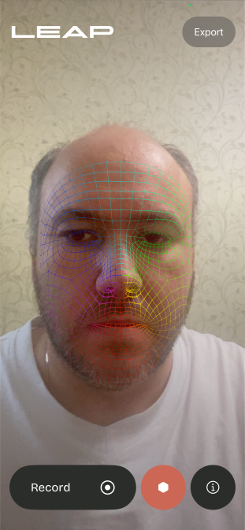

When you are ready, stop recording and export the archive with your data.

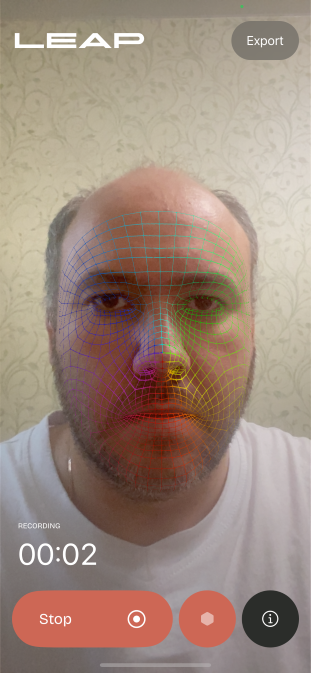

We'll use this archive in the next step to make facial animations.

## Leap UE plugin

Avatar SDK Leap UE plugin simplifies the integration of revolutionary Leap Facial Capture technology with your Unreal Engine projects. After capturing your data with the Leap application for iPhone, export the collected data to your computer disk. Using this data, the Avatar SDK Leap UE plugin creates a realistic facial animation sequence for your 3D avatar in a few clicks. The plugin will create all the required assets in a few minutes, including skeletal mesh, textures, materials, and animations. 

### Prerequisites

- OS: Windows
- Unreal Engine version: 5.3, 5.4 or 5.5
- You will need an iPhone with Leap application installed to capture the facial animation data.

### Minimal technical requirements

- RAM: 16 GB 
- GPU: GeForce RTX 3050
- CPU: Intel i7 7th gen

### Sample project
The Leap plugin comes with a sample UE project to help you start with facial animation creation. Open the project by double-clicking on the LeapDemo. project file.


Another option - in the Unreal Engine Project browser, click on the Browse button in the Recent Projects partition and provide a path to the LeapDemo:


When you open the project, the Leap sample level will be loaded. You can explore the sample animation provided with the project at `/Content/AvatarSdkLeap/Victor`.


To import your animation, click the `Window->Avatar SDK Leap` menu to open the plugin window.


Choose the name for your [level sequence](https://dev.epicgames.com/documentation/en-us/unreal-engine/sequences-shots-and-takes-in-unreal-engine#levelsequences), and choose a type of avatar to be generated. Click the `Use materials for Ray tracing` if you intend to use path tracing to render your level sequence. For your first try, we recommend leaving it in its default state.


Click on the `Import Leap Animation` button and provide a path with the archive you got after capturing data with your iPhone Leap application. After that, the MetaPerson window will open, and the avatar generation process will begin.

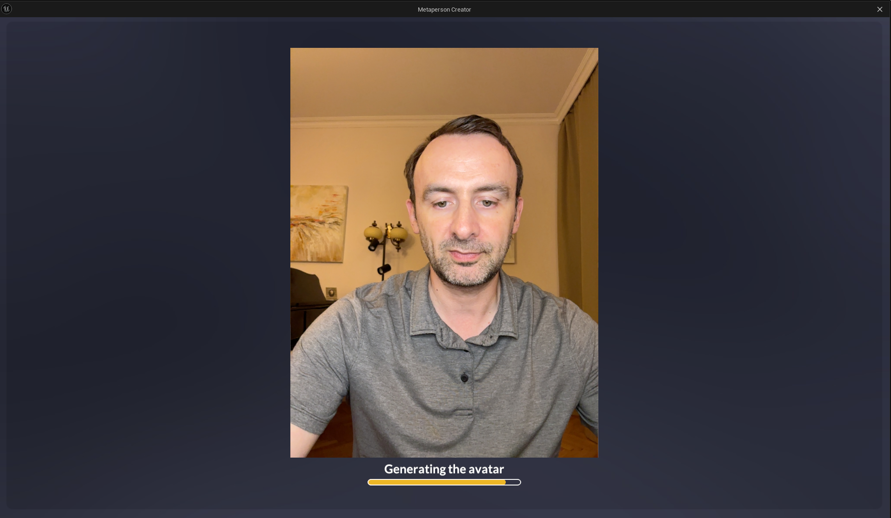

When the avatar is ready, you can customize it extensively. You can choose from various outfits, from casual to formal, ensuring your avatar matches your style perfectly. Additionally, explore numerous haircut styles to give your avatar a distinct look that reflects your personality. We plan to add almost all assets currently available in the MetaPerson Creator later, so stay tuned.

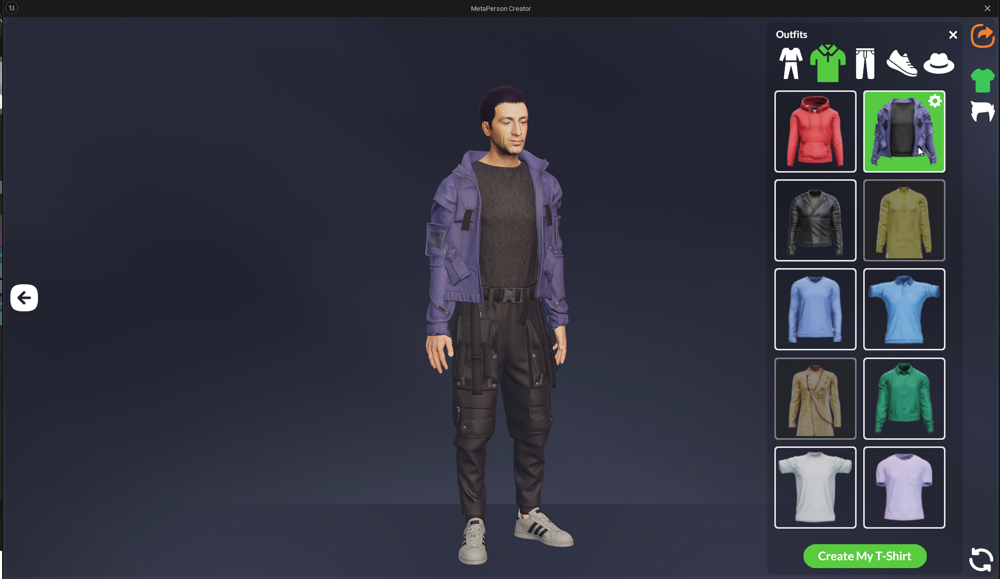

Once you are ready with customization, click on the export button. After you click, wait for the export process to finish. This process might take a little time.

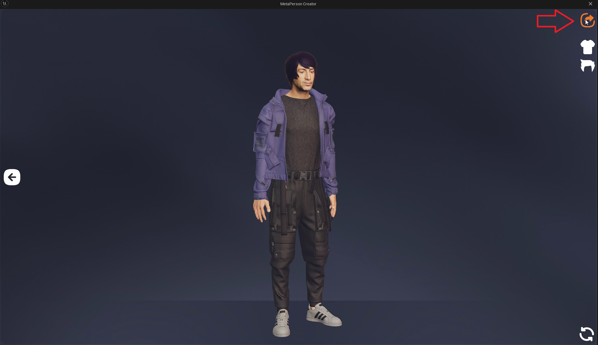

Once the export process has been successfully completed, it will take a few more seconds to download the avatar animation file and import it to Unreal Engine.

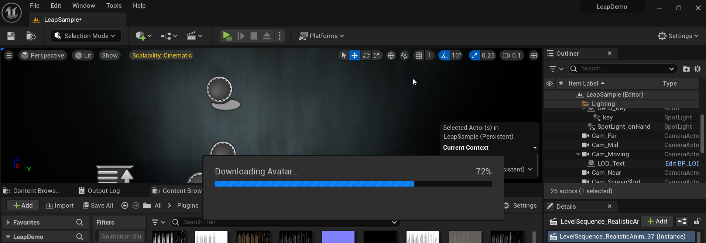

Now the Level Sequence asset with the animation is ready, and you may open it by clicking on the corresponding button. Click the `Open Directory` button to explore all the assets imported into your project.


The imported animation files may be found in the `/Content/AvatarSdkLeap` directory:


The created level sequence contains tracks for the camera, texture, and body skeletal mesh. You can edit the created tracks and assets according to your requirements.


A corresponding Level Sequence Actor will be placed on the current opened level. This Level Sequence Actor may be used to create cinematic content for games and traditional animation in Unreal Engine. The Actor is placed at the location that can be configured in the plugin settings `Edit->Project Settings->Avatar SDK Leap`:


### Rendering Video

To render the image frame sequence from your Level Sequence, click on the corresponding button in the Sequencer:


Choose among the predefined Rendering Settings, or create your own. We recommend to use the `RA_No_PT_Config_FAST` to get the fastest result:


The config `RA_No_PT_Config_MID` should give better results and does not use path tracing.
The config `RA_PT_Config` is made for path tracing rendering. These configurations represent a trade-off between quality and rendering time.
Click on the `Render Local` button to start the rendering:


By default, the Level Sequence will be rendered as a sequence of PNG images that can be found in the `\Saved\MovieRenders` subdirectory of the project directory. Use video editing software to create video from the set of images. A good option is to use FFmpeg. In such case, the command may look like this:

```
ffmpeg -r 60  -i "Saved\MovieRenders\LevelSequence_RealisticAnim_0.%04d.png" -c:v libx265 -crf 2 -vf format=yuv420p10le -tag:v hvc1  "I:\renders\video0.mp4" -y
```

## Leap Unity plugin

With just a few clicks, the Avatar SDK Leap Unity plugin creates a realistic facial animation sequence for your 3D avatar. It requires you to copy captured data from the Leap application to your computer, where the plugin processes it.

### Requirements

* OS: Windows 10 64-bit
* Unity 6.0 (6000.0.48f1) or above
* Intel or AMD processor with AVX extension set (recommended i7-7700HQ or higher)
* 6 GB of RAM available

### Getting Started

1. Download and extract the archive containing the Avatar SDK Leap Unity project.
2. Open the project in Unity 2022.3.17f1 or later.
3. Open the `Assets/AvatarSDK/Leap/Samples/1-GettingStartedSample.unity` scene.
4. Press the Play button in the Unity Editor to run the scene.  
5. Use the Select Archive button to choose the archive containing captured data from the iPhone Leap application.  
There is an archive with the sample avatar in `Assets/StreamingAssets/itseez3d/avatar_sdk_leap/sample_avatar` directory. You can use it if you don't have the Leap application. 
6. Select the avatar's gender and press the Generate to compute the 3D avatar model and its animation.  
7. After computation, press the Play button to preview the animation.

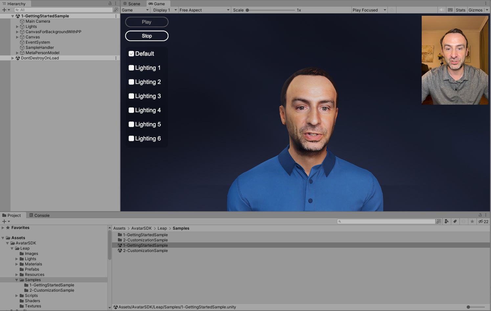

### Customization Sample

This sample demonstrates how to customize a generated avatar by modifying its haircut and outfit using the [MetaPerson Creator](https://metaperson.avatarsdk.com/). 
The MetaPerson Creator page is displayed within a web view component in the Unity scene. 
The process involves generating a local avatar, selecting haircuts and outfits via MetaPerson Creator, and downloading the customized avatar back to display on the scene.

#### Dependencies
1. **Web View Component**

To show the [MetaPerson Creator](https://metaperson.avatarsdk.com/) page in the Unity scene, a web view component is required. 
This sample uses the [Vuplex Web View](https://store.vuplex.com/webview/windows-mac). [Contact us](mailto:support@itseez3d.com) for a 20% discount on this plugin.

2. **File Browsing Support**

To open a file selection dialog in a standalone Windows application, the sample uses the [Open File Dialog for Windows](https://assetstore.unity.com/packages/tools/utilities/open-file-dialog-for-windows-282619) plugin.
If using this plugin, add the `USE_FILE_DIALOG` script compilation definition to your project.

#### Steps To Run
1. Open the `Assets/AvatarSDK/Leap/Samples/2-CustomizationSample.unity` scene.
2. Press the Play button in the Unity Editor to run the scene.
3. Select an archive containing captured data from the iPhone Leap application or generate a sample avatar.

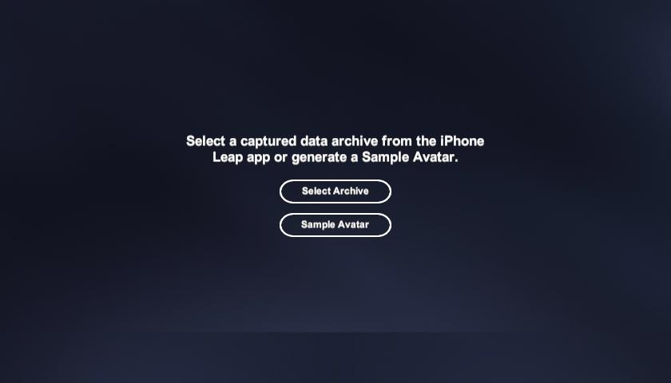

4. While the animation is being processed, open the [MetaPerson Creator](https://metaperson.avatarsdk.com/) to customize the avatar.
You can skip this step to use the default outfit and the "Generated" haircut.

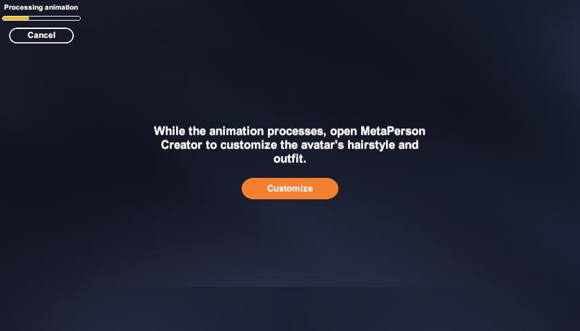

5. After completing the avatar customization, press the "Go ahead" button to download the updated model and display it in the scene.

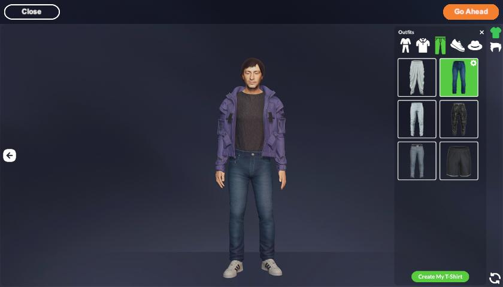

6. Once the model is loaded, press the Play button to run the animation.

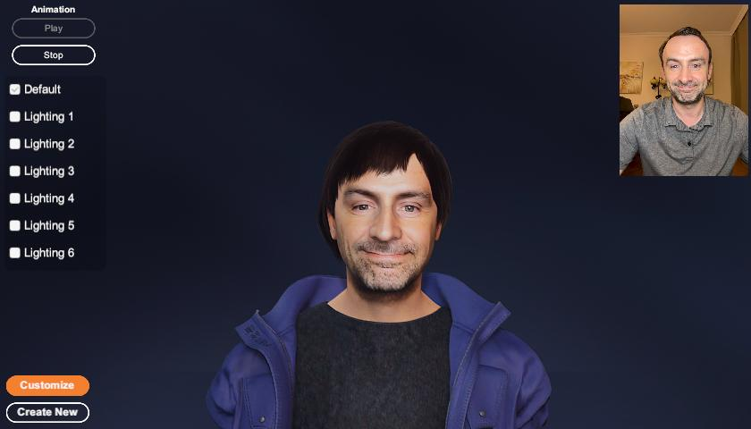

### How It Works

#### Compute Avatar and Animation

The `LeapProcess` class handles avatar and animation computation. Call its `GenerateAvatar` method, passing the path to the archive with captured data and the avatar's gender. 
Computations are asynchronous. Upon completion, retrieve the `AvatarCode` for the generated model.


```js
LeapProcess leapProcess = new LeapProcess();
bool isGenerated = await leapProcess.GenerateAvatar("path_to_an_archive_with_captured_data", AvatarGender.Male);
if (isGenerated)
{
  string avatarCode = leapProcess.AvatarCode;
}
else
  Debug.LogError("Failed to generate avatar");
```

#### Play Animation

To show the avatar and to play the animation, you should add the `Leap Animator` component to the scene and specify the [`Meta Person Loader`](https://github.com/avatarsdk/metaperson-loader-unity) component. 

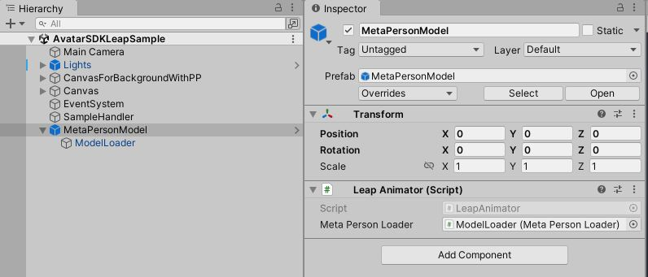

Load the model using the `LoadModel` method, passing the avatar code, and then call `PlayAnimation` to start playback.

```js
string avatarCode = leapProcess.AvatarCode;
bool isLoaded = await leapAnimator.LoadModel(avatarCode);
if (isLoaded)
  leapAnimator.PlayAnimation();
else
  Debug.LogError("Failed to load avatar model");
```

#### Avatar Customization
The [MetaPerson Creator](https://metaperson.avatarsdk.com/) is used to customize the avatar. 
For detailed steps on integrating MetaPerson Creator into a Unity desktop application, refer to the [MetaPerson Creator Integration Guide](business-integration/unity/windows_and_macos).

To generate an avatar, send a `generate_leap_avatar` event message to MetaPerson Creator using the [JS API](js_api). This message must include:
* **Avatar gender**: Specify the desired gender.
* **Base64-encoded ZIP archive**: A ZIP archive containing the following files:
  * `photo.jpg`
  * `data.bin`
  * `faceGeometry1.obj`

These files can be extracted from the archive created by the iPhone Leap application.

Here’s an example message structure:

```js
let generateAvatarMessage = 
{
  'eventName': 'generate_leap_avatar',
  'gender' : genderStr,
  'zipArchiveBase64' : zipArchiveBase64Str
};
window.postMessage(generateAvatarMessage, '*');
```

Use the `LeapUtils.PrepareArchiveForCloudComputations` method to prepare an archive to send to MetaPerson Creator.

```js
byte[] archiveBytes = LeapUtils.PrepareArchiveForCloudComputations("local_leap_avatar_code");
string base64Archive = Convert.ToBase64String(archiveBytes);
```

Once MetaPerson Creator receives the `generate_leap_avatar` message, it computes the avatar and allows you to customize it.

Use the [Export Avatar JS API](js_api#export-avatar) message to export and download the customized avatar.

The animation generated by the Avatar SDK Leap Unity plugin can then be applied to the customized avatar.

### Leap Streaming Sample

This sample demonstrates how to stream facial animation data in real time from the **Leap iOS app** to **Unity**.

The iOS app sends facial capture frames to the Unity plugin via **WebSocket**. The plugin processes each frame, computes the avatar’s texture, applies blendshapes and pose of the head dynamically.


#### Steps To Run
1. Open the Unity scene: `Assets/AvatarSDK/Leap/Samples/5-LeapStreamingSample.unity`.
2. Press **Play** in the Unity Editor to start the scene.
3. Enter your computer’s **IP address** and a **port number** for the connection.
4. Click the **Start** button in Unity.


5. Open the **Leap iOS app** on your device.
6. Navigate to **Settings**.
7. Enter the same **IP address** and **port** as specified in Unity.
8. Tap **Connect**, then close Settings.

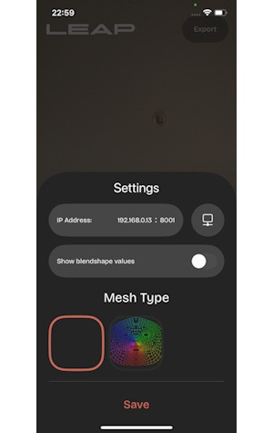

9. Point your device’s camera at your face and tap **Stream**.

#### Important Notes
- **Network Requirement**: Your mobile device and computer must be on the **same local network** to establish a connection.
- The **first frame** captured is used to generate the avatar. For best results, maintain a **neutral facial expression** during this step.
- The Unity plugin undergoes three stages before displaying the avatar: Computing, Exporting, Loading.
- The entire process takes **approximately 1 minute**. Progress is displayed in the sample scene.
- Once loaded, the avatar will animate in real time based on the streamed frames from the iOS app.

### HDRP Sample

An advanced sample project demonstrating high-quality Leap avatar rendering in Unity's High Definition Render Pipeline (HDRP) can be found in the github repository: https://github.com/avatarsdk/leap-unity-hdrp-sample


## Leap Demo Application For Windows

We provide a Leap Demo Application that allows you to quickly generate an avatar and explore how this technology works.
The application is based on the [Unity Customization Sample](#customization-sample) but does not require a Unity installation.

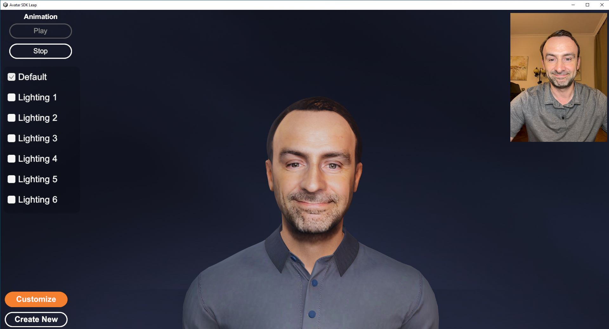

1. Download and extract the archive containing the Avatar SDK Leap Demo application.
2. Run the Avatar SDK Leap.exe executable.
3. You can select an archive containing captured data from the iPhone Leap application or generate a sample avatar. 
4. While the animation is being processed, press the Customize button to choose outfits and haircuts for the avatar. You can skip this step.
5. After computation, press the Play button to preview the animation.

## Support
Please feel free to ask any questions about the Avatar SDK Leap at support@avatarsdk.com
