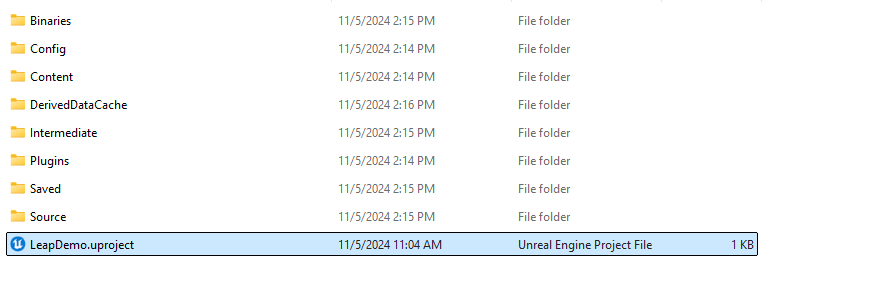
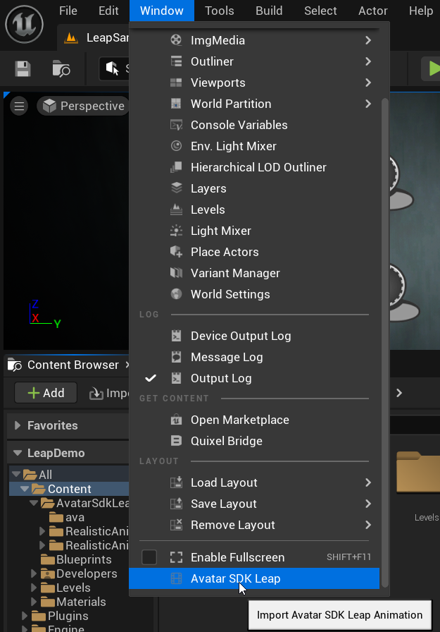
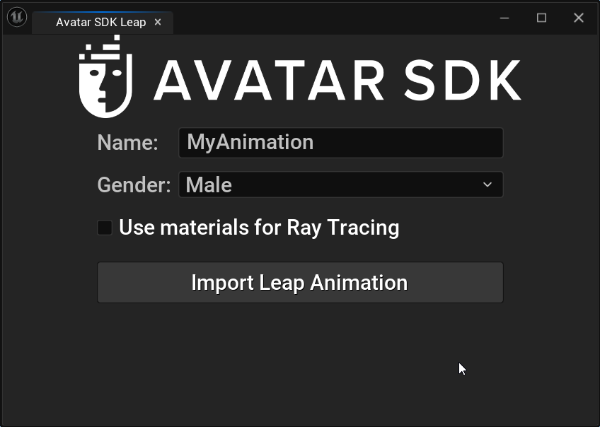
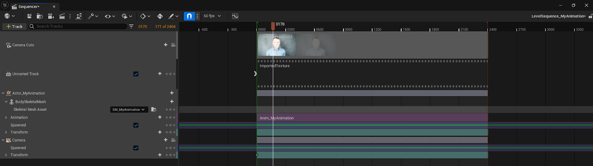
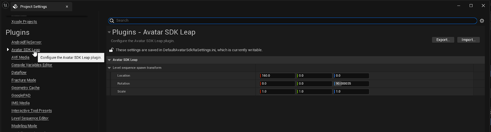
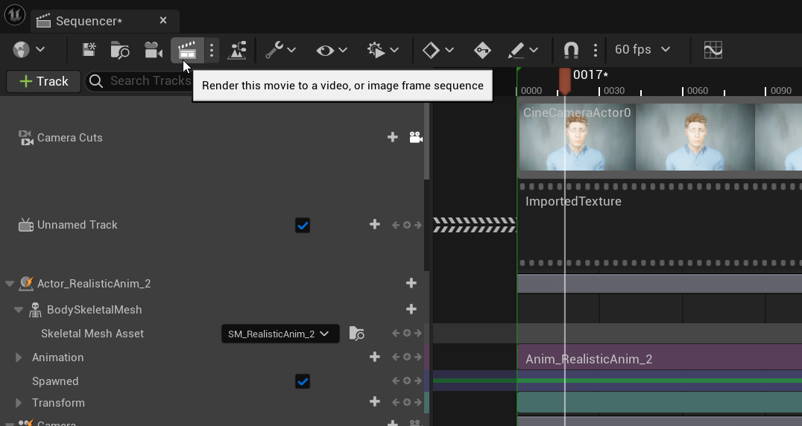
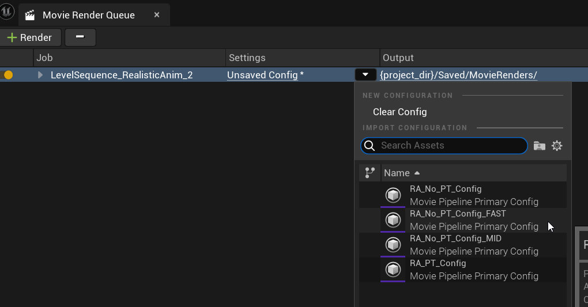

# Leap Realistic Facial Animation

## What is Avatar SDK Leap UE plugin? 

Avatar SDK Leap UE plugin simplifies the integration of revolutionary Leap Facial Capture technology with your Unreal Engine projects. After capturing your data with the Leap application for iPhone, export the collected data to your computer disk. Using this data, the Avatar SDK Leap UE plugin creates a realistic facial animation sequence for your 3D avatar in a few clicks. The plugin will create all the required assets in a few minutes, including skeletal mesh, textures, materials, and animations. 

## Prerequisites

OS: Windows
Unreal Engine version: 5.3 or 5.4
You will need an iPhone with Leap application installed to capture the facial animation data.

## Minimal technical requirements

RAM: 16 Gb 
GPU: GeForce RTX 3050
CPU: Intel i7 7th gen

## Sample project
The Leap plugin comes with a sample UE project to help you start with facial animation creation. Open the project by double-clicking on the LeapDemo. project file.



Another option - in the Unreal Engine Project browser, click on the Browse button in the Recent Project partition and provide a path to the LeapDemo:


When you open the project, the Leap sample level will be loaded. You can explore the sample animation provided with the project at `/Content/AvatarSdkLeap/Victor`


To import your animation, click the `Window->Avatar SDK Leap` menu to open the plugin window.




Choose the name for your [level sequence](https://dev.epicgames.com/documentation/en-us/unreal-engine/sequences-shots-and-takes-in-unreal-engine#levelsequences), and choose a type of avatar to be generated. Click the `Use materials for Ray tracing` if you intend to use path tracing to render your level sequence. For your first try, we recommend leaving it in its default state.



Click on the `Import Leap Animation` button and provide a path with the archive you got after capturing data with your iPhone Leap application. After that, the processing begins.


Depending on your hardware setup, processing may take from 4 to 5 minutes.
When the processing is finished, you will be able to open the resulting level sequence or explore the assets created by Leap in the destination folder.


The imported animation files may be found in the `/Content/AvatarSdkLeap` directory:


Created level sequence contains tracks for the camera, texture and body skeletal mesh. You can edit the created tracks and assets according to your requirements.



A corresponding Level Sequence Actor will be placed on the current opened level. This Level Sequence Actor may be used to create cinematic content for games and traditional animation in Unreal Engine. The Actor is placed at the location that can be configured in the plugin settings `Edit->Project Settings->Avatar SDK Leap`:



## Rendering Video

To render the image frame sequence from your Level Sequence, click on the corresponding button in the Sequencer:



Choose among the predefined Rendering Settings, or create your own. We recommend to use the `RA_No_PT_Config_FAST` to get the fastest result:



The config `RA_No_PT_Config_MID` should give better results and does not use path tracing.
The config `RA_PT_Config` is made for path tracing rendering. These configurations represent a trade-off between quality and rendering time.
Click on the `Render Local` button to start the rendering:


By default, the Level Sequence will be rendered as a sequence of PNG images that can be found in the `\Saved\MovieRenders` subdirectory of the project directory. Use video editing software to create video from the set of images. A good option is to use FFmpeg. In such case, the command may look like this:

```
ffmpeg -r 60  -i "Saved\MovieRenders\LevelSequence_RealisticAnim_0.%04d.png" -c:v libx265 -crf 2 -vf format=yuv420p10le -tag:v hvc1  "I:\renders\video0.mp4" -y
```

## Support
Please feel free to ask any questions about the Avatar SDK Leap at support@avatarsdk.com
