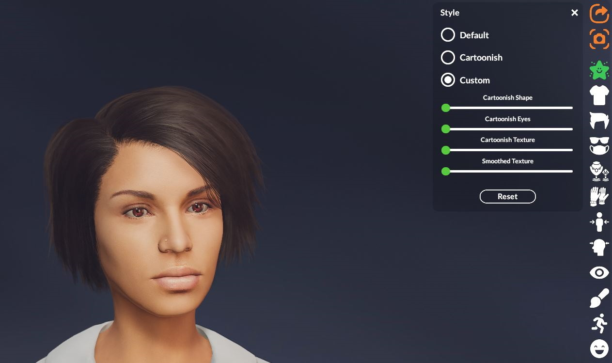

# Cartoonish Avatars

The **Cartoonish** option in MetaPerson Creator offers a playful, stylized alternative to realistic avatars — perfect for games, social VR, and other 3D experiences.
Whether you want a lifelike digital twin or a fun, animated persona, you can now support both with just a click.

### Generating Cartoonish Avatars

1. Go to [MetaPerson Creator](https://metaperson.avatarsdk.com) and design your avatar.
2. Click the **Style** button.
3. Select the **Cartoonish** option.

### Customization Options

You can fine-tune your cartoonish avatar with these parameters to create a unique look:

 
#### Cartoonish Shape

Adjusts the face shape to give it a more exaggerated, cartoon-like appearance.

#### Cartoonish Eyes

Makes the eyes larger, giving them a cartoon-style appearance.

#### Cartoonish Texture

Applies a smoothed, stylized texture to the head and body, adding a subtle reddish tint.

*Note: This turns off the Smoothed Texture option.*

#### Smoothed Texture

Softens the head and body textures for a more polished look.

*Note: This turns off the Cartoonish Texture option.*

