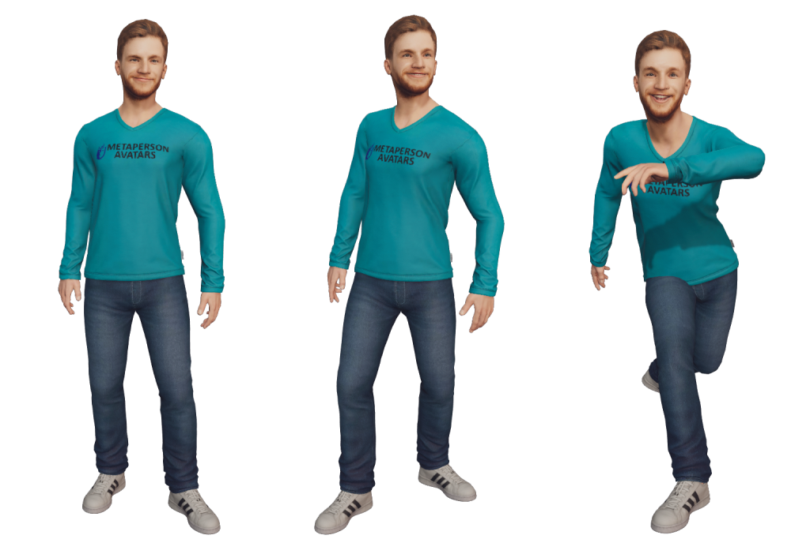
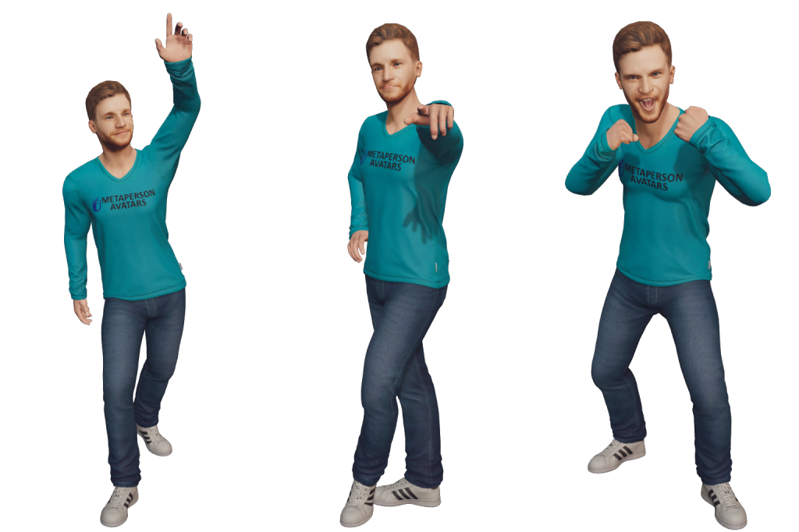
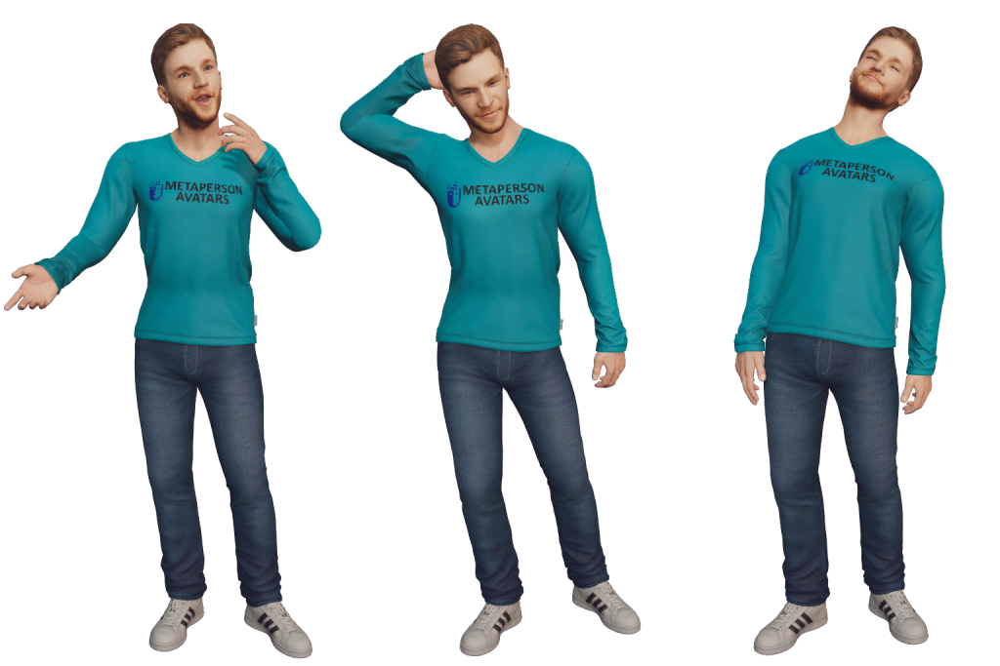

# Get a Pack of 2D Avatar Images

You can download a set of 2D images featuring your avatar with different expressions and poses.

**How to do it:**

1. Open your avatar in [MetaPerson Creator](https://metaperson.avatarsdk.com).

2. Click the **Screenshot** button in the right panel.

3. Download the generated archive containing the images.

