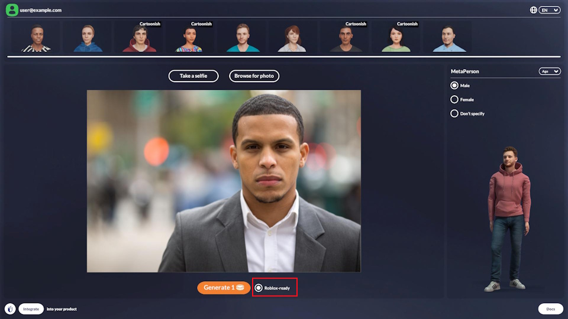
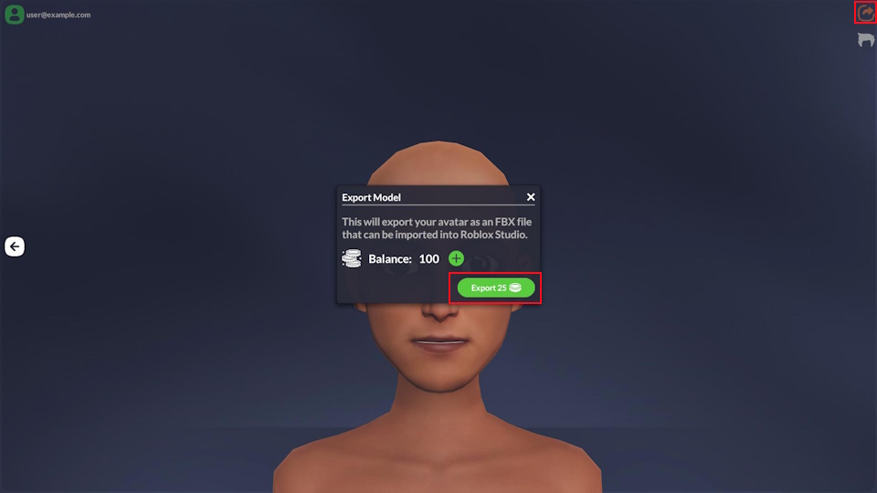
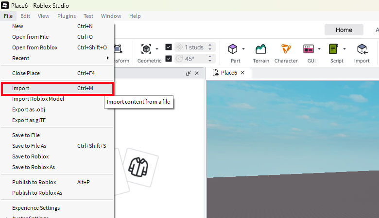
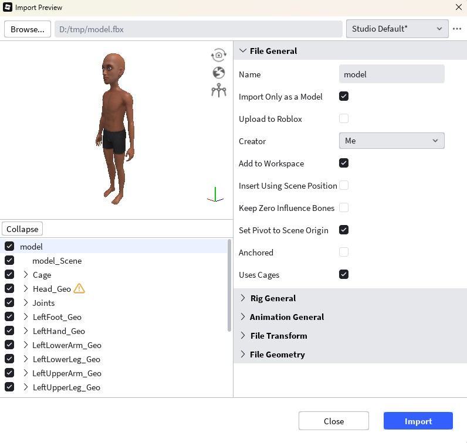
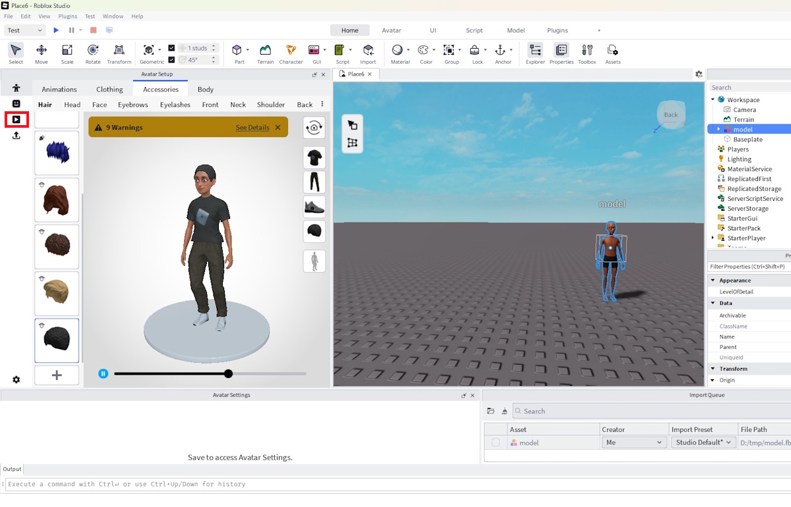
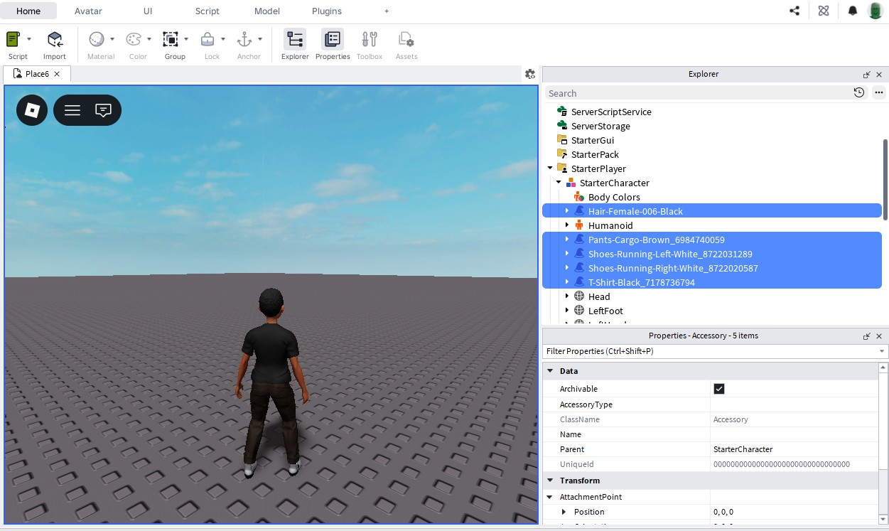
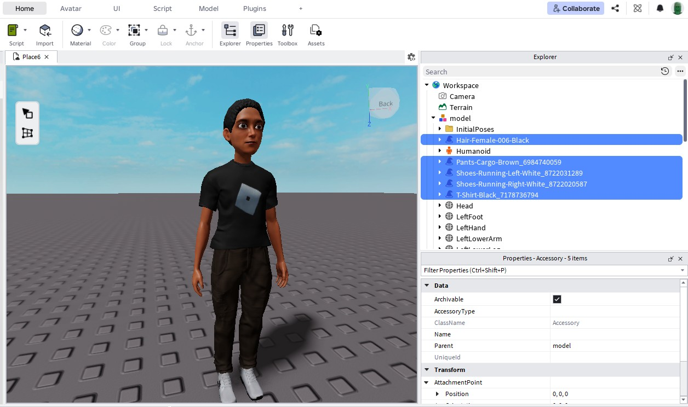
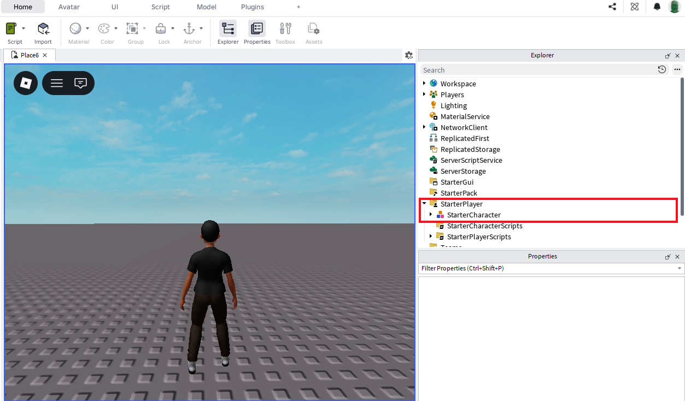

# Roblox Avatars

MetaPerson Creator lets you create and export **Roblox‑compatible** avatars that can be imported into **Roblox Studio** and used in your experiences.

<iframe width="560" height="315" allow="fullscreen"
src="https://www.youtube.com/embed/a_UD4AuVXYU">
</iframe>

&nbsp;

### Getting started

Follow these steps to generate and import a Roblox avatar:

1. Choose an image, enable the **Roblox‑ready** option, and **Generate** the avatar.

2. **Export** the avatar. The FBX model download will start after export completes.

3. Open **Roblox Studio** and **import** the downloaded FBX file.

4. In the **Avatar Setup** window, customize the model and press **Test in Experience** button.

5. (Optional) Copy configured assets such as clothing and hair.

6. Stop the experience and **paste** the copied assets onto the imported model.

7. To use the model as the player's character, rename it to **StarterCharacter** and place it under the **StarterPlayer** in the Explorer.

### Support

If you have issues or questions, contact the MetaPerson Creator support team at support@avatarsdk.com.